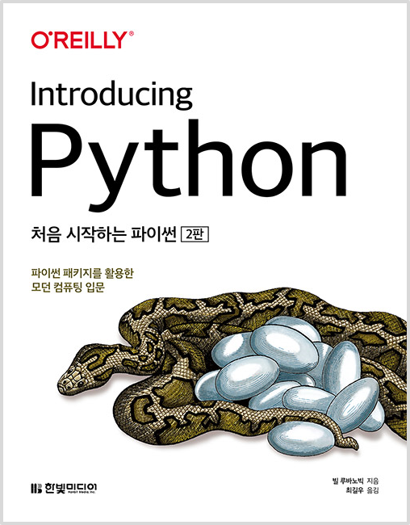

# IntroducingPython

  
  <h1>처음 시작하는 파이썬 2판</h1>
  

    
    
    
  

---

## ✅ CheckLists

- [ ] 5월까지 1회독 하기

---

## 👩‍💻 Study Notes

| 챕터 |             제목             | 공부 날짜 |
| :--: | :--------------------------: | :-------: |
|  1   |       파이(py) 맛보기        |  2024.01.30.  |
|  2   | 데이터: 타입, 값, 변수, 이름 |  2024.01.31.  |
|  3   |             숫자             |  2024.01.31.  |
|  4   |         선택하기: if         | 2024.02.01. |
|  5   |        텍스트 문자열         |  2024.03.18.  |
|  6   |    반복문: while과 for 문    |  2024.03.20.  |
|  7   |        튜플과 리스트         | 2024.03.22. |
|  8   |        딕셔너리와 셋         |   2024.03.25. |
|  9   |             함수             | 2024.04.01.  |
|  10  |        객체와 클래스         | 2024.07.12.   |
|  11  |        모듈과 패키지         | 2024.07.12. |
|  12  |       데이터 길들이기        |  2024.07.12.  |
|  13  |         날짜와 시간          |  2024.07.12.  |
|  14  |       파일과 디렉터리        |  2024.07.16.  |
|  15  |      프로세스와 동시성       |  -  |
|  16  |     파일과 데이터베이스      |  - |
|  17  |           네트워크           |  -  |
|  18  |              웹              |  - |
|  19  |      파이써니스타 되기       | - |
|  20  |          파이 아트           | 2024.07.16. |
|  21  |        파이 비즈니스         | -  |
|  22  |          파이 과학           |  -  |
|      |           Appendix           |    |
